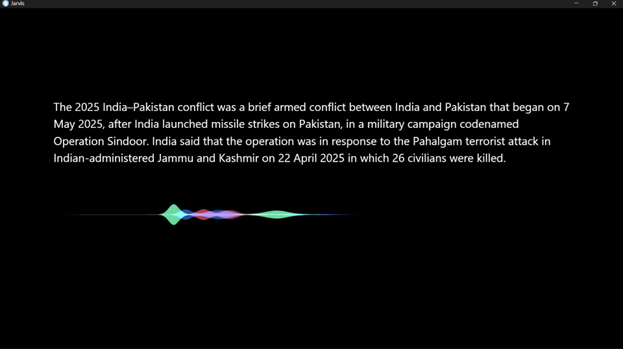
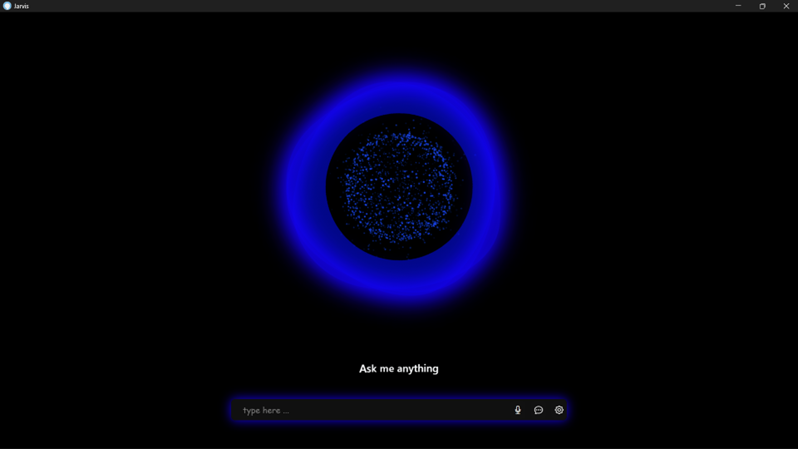
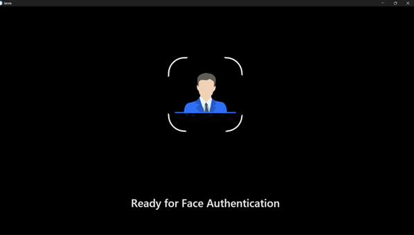
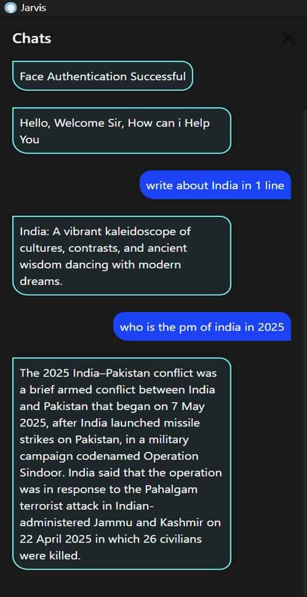
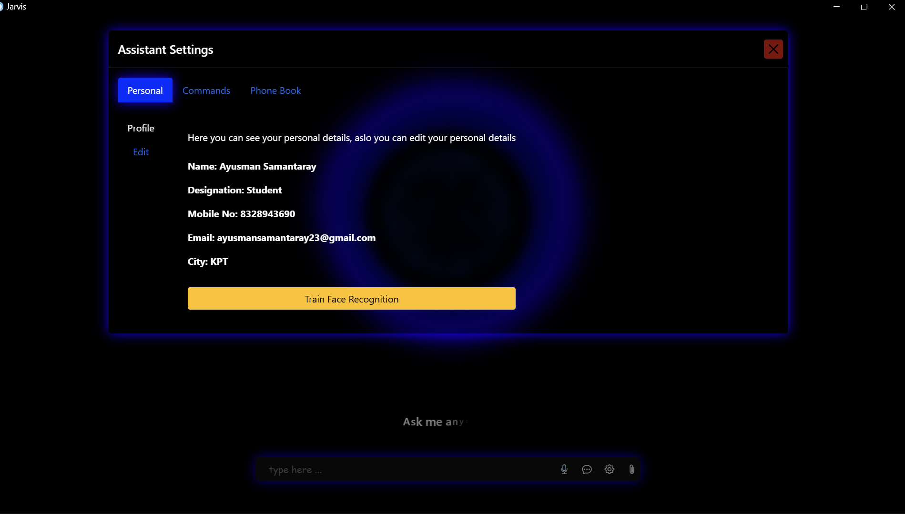
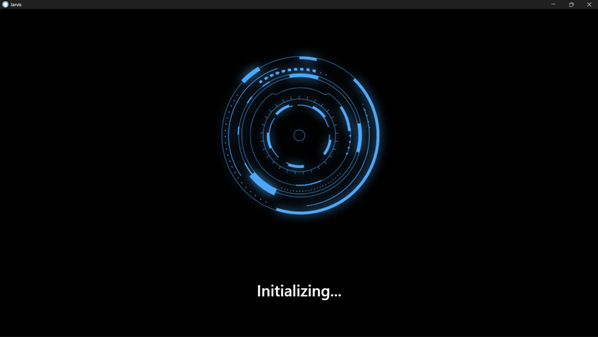
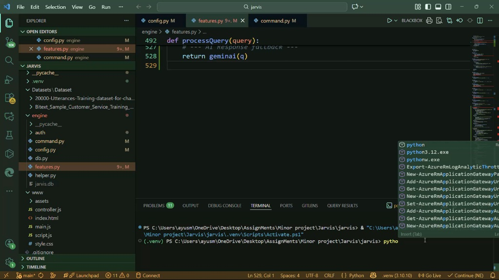

# J.A.R.V.I.S - Advanced AI Voice Assistant

J.A.R.V.I.S is a highly capable, professional, and real-time AI voice assistant designed to assist with a variety of tasks ranging from general inquiries to complex mathematical problem-solving and multi-modal file analysis.

---

## 🚀 Key Features

### 👤 Advanced Authentication
* **Face Recognition:** Secure access using local face authentication.
* **Face Training:** Integrated training module to improve recognition accuracy directly from the UI.

<p align="center">
  
  
</p>

### 🧠 Intelligent Brain (Gemini 2.0 Flash)
* **Contextual Reasoning:** Remembers the context of uploaded files or previous interactions.
* **Multi-modal Analysis:** Understands and describes images using Vision AI.
* **Complex Problem Solving:** Solves logic puzzles and word problems with step-by-step reasoning.

### 📁 Content Analysis & Interface
* **Folder Analysis:** Upload a folder to get a technical summary of its purpose and structure.
* **Siri-Wave Animation:** Smooth, interactive voice wave during speech.
* **Text Rendering:** Real-time character-by-character text typing for responses.

<p align="center">
  
  
</p>

---

## 📸 Gallery & Development

### Conversation & Chat History
<p align="center">
  
</p>

### Assistant Settings & Backend
<p align="center">
  
  
</p>

---

## 📺 Demo Video
Experience J.A.R.V.I.S in action:

<p align="center">
  <video src="assets/Minor.mp4" width="100%" controls>
    Your browser does not support the video tag.
  </video>
</p>

---

## 🛠️ Technology Stack
* **Logic:** Python 3.10+
* **Frontend-Backend Bridge:** Eel
* **AI Engine:** Google Gemini API
* **Computer Vision:** OpenCV, face_recognition

---

## ⚙️ Installation & Setup
1. **Clone the Repository:**
   ```bash
   git clone [https://github.com/Ayusman23/Ai-Virtual-Assistant.git](https://github.com/Ayusman23/Ai-Virtual-Assistant.git)

```

2. **Install Dependencies:**
```bash
pip install -r requirements.txt

```


3. **Run Assistant:**
```bash
python run.py

```


---

### How to push the final update:
1.  **Open CMD** in your project folder.
2.  Run `git add .`
3.  Run `git commit -m "Final README with video and asset links"`
4.  Run `git pull origin main --rebase`
5.  Run `git push origin main`

**Would you like me to show you how to rename those long file names to something simpler in one go?**

```
